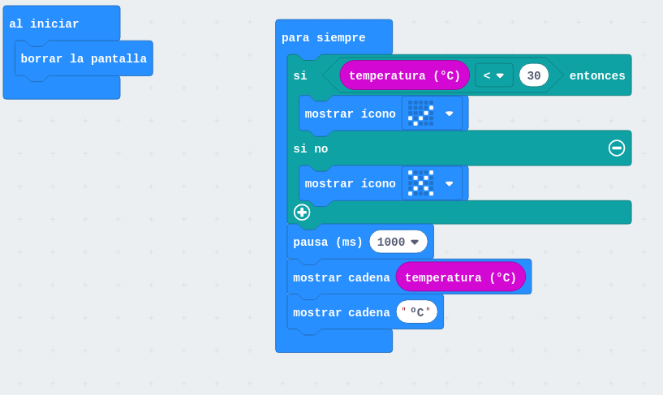
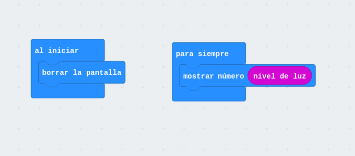

# Desafio Programación

## El Desafío: ¿Se puede aprender a programar desde cero y en tan solo una hora para resolver un problema de la vida cotidiana?

### SummerCamp by @Conecta13

### José Antonio Vacas @javacasm

(ejemplos tomados de la charla de Lorenzo Olmo del Club de Robótica de Granada)

## ¿Cómo ves la tecnología?

|IronMan way|America Captain Way|
|:---:|:---:|
||

------

# BBC-micro:bit IronMan way

[Fundación micro:bit](http://microbit.org/es/)

[micro:bit es totalmente opensource](https://www.microbit.co.uk/open_source)

[Github de micro:bit](https://github.com/bbcmicrobit)

### [Hardware](http://microbit.org/es/hardware/) [micro:bit](https://en.wikipedia.org/wiki/Micro_Bit#Hardware)

#### [Alimentación](https://support.microbit.org/support/solutions/articles/19000013982-how-do-i-power-my-micro-bit-)

Funciona a 3V y dispone de un conector de bateria y de alimentación por USB (MicroUSB)

#### Micro
ARM M0 (Nordic nRF51822 – 16 MHz 32-bit ARM Cortex-M0 microcontroller 32 bits) , 256 KB flash memory, 16 KB static ram

#### [Sensores](https://microbit.org/guide/features/)

* Acelerómetro
* Brújula
* Sensor de temperatura está en la CPU (https://microbit.org/es/guide/temperature/)
* 2 Botones
* 3 entradas analógicas (0,1,2)
* 20 pines I/O

#### Comunicaciones

[Bluetooth](http://microbit.org/es/mobile/) de bajo consumo

Comunicaciones via radio entre distintas micro:bits

[App micro:bit](https://play.google.com/store/apps/details?id=com.samsung.microbit&hl=es) Nos permite interaccionar con la placa e incluso programarla

#### Leds

25 (5x5) leds programables individualmente

### Programación

[Revisión sobre las diferentes plataformas](https://hackaday.com/2017/12/02/exploring-the-bbc-microbit-software-stack/)

[Programando con bloques](https://pxt.microbit.org/?lang=es)

[Programando en python](http://python.microbit.org/)

[Python en Mibrobit](https://www.python.org/community/microbit/)

[Programando con el IDE de Arduino](https://learn.adafruit.com/use-micro-bit-with-arduino?view=all)

[Flappy bird en python](https://www.elecfreaks.com/12454.html)

### Dónde comprarlo

[Revendedores](http://microbit.org/es/resellers/)

[También en Amazon](https://www.amazon.es/BBC-MB80-Micro-Bit/dp/B01G8WUGWU/ref=sr_1_2?ie=UTF8&qid=1492513787&sr=8-2&keywords=micro:bit)

### Complementos/shields

[Placa adaptadora 3.3v/5v y de fácil conexión de sensores](https://www.elecfreaks.com/12396.html)

### Robots

http://www.instructables.com/id/Remote-Controlled-micro:bit-Robot/

#### [MaQueen](./MaQueen.md)

### Documentación

[Getting started](http://microbit.org/es/start/)

[Placa conexión con octupus](https://www.elecfreaks.com/12396.html)

[Usando la Brújula](https://www.elecfreaks.com/12412.html)

[Arcade in javascript](https://www.elecfreaks.com/12416.html)

### Recursos

[Nice review](https://www.youtube.com/watch?v=7qnSsc54bEQ)

# micro:bit America Captain way

#### [Sensores](https://microbit.org/guide/features/)

* Acelerómetro
* Brújula
* Sensor de temperatura está en la CPU (https://microbit.org/es/guide/temperature/)
* 2 Botones
* 3 entradas analógicas (0,1,2)
* 20 pines I/O

#### Leds

25 (5x5) leds programables individualmente

### Entorno de Programación

No necesitamos instalar nada, funciona via web y en tablet/móviles  

Se puede programar con bloques, javascript, python, C++ de Arduino...

# Programación con bloques https://makecode.microbit.org/

El **simulador** es interactivo y cambia la imagen del simulador a medida que usamos diferentes bloques

Los programas se guardan por defecto en nuestro navegador

Seleccionamos el idioma

La pantalla: 
* A la izquierda, Podemos simular nuestro programa
* Centor las paletas de bloques
* Bloques de mi programa

Añadir nuestros bloques en **onStart** (para que se ejecute al principio) o **forever** (para que se ejecute repetitivamente)

## Ejemplo [HOLA MUNDO](https://makecode.microbit.org/_MfyHdrLXVWqL)

Podemos cambiar el nombre del programa
 
Una vez que tenemos un programa vamos a **reprogramar** la micro:bit

1. **Conectamos** el micro:bit
1. Aparece la **unidad micro:bit**
1. **Descargamos** el programa
1. Lo **copiamos** a la unidad micro:bit (veremos como parpadea el led naranja)
(En un tablet o móvil necesitaremos un cable OTG)

Podemos **compartirlo**

## Ejemplo de temperatura

Usamos el sensor de temperatura (que está en la CPU con lo que no es muy preciso)

1. Mostrar temperatura
1. Mostrar la temperatura en forma de barra

[Control de temperatura](https://makecode.microbit.org/_LesCE2h70PAT)

Ejemplo: Control de iluminación digital y analógico

[Medimos y mostramos el nivel de iluminación](https://makecode.microbit.org/_YqD3MePtK6gU)

[Control digital de la iluminación](https://makecode.microbit.org/_TVJAFy9mjJ3Y)

[Control analógico de iluminación](https://makecode.microbit.org/_7ayKTtKvXFcc)

## Eventos

#### ¿Qué es un evento?

Pulsaciones de botones o cambios de pines, agitado

### Ejemplo: [¿a quién le toca?](https://makecode.microbit.org/_f9EhoRAp1eoR)
* Botón A incrementa
* Botón B decrementa 
* Agitando pone número aleatorio

## Juegos

#### Ejemplo: [piedra, papel o tijera](https://makecode.microbit.org/_0Xi5xA7gweK5)

#### Ejercicio: dado digital

### Juegos semiprofesionales

Hay una paleta de juegos que incluyen sprites, puntuaciones, etc

Los leds se direccionan así
(0,0) ..... (4,0)
...          ...
(0,4) ..... (4,4)

#### Ejemplo: marcianitos simples

### Extensiones

Permiten usar extensiones que añaden más bloques 

### Proyectos
* Proyecto termostato: los botones fijan la temperatura objetivo y la otra barra nos muestra la temperatura actual

* Proyecto maquinilla de numeros (innalámbrica)

    
